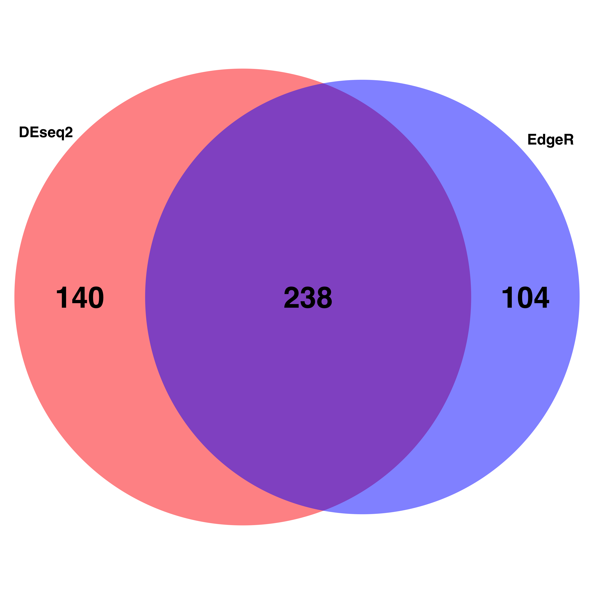

# Load required R libraries 
```{r libraries, message=FALSE, warning=FALSE}
#(install first from CRAN or Bioconductor)
library("knitr")
library("rmdformats")
library("tidyverse")
library("DT")  # for making interactive search table
library("plotly") # for interactive plots
library("ggthemes") # for theme_calc
library("reshape2")
library("DESeq2")
library("data.table")
library("apeglm")
library("ggpubr")
library("ggplot2")
library("ggrepel")
library("EnhancedVolcano")
library("SARTools")
library("pheatmap")
library("VennDiagram")

## Global options
options(max.print="10000")
knitr::opts_chunk$set(
	echo = TRUE,
	message = FALSE,
	warning = FALSE,
	cache = FALSE,
	comment = FALSE,
	prompt = FALSE,
	tidy = TRUE
)
opts_knit$set(width=75)
```

# Import the final files from DEseq2 and edgeR

```{r import DE, message=FALSE, warning=FALSE}
projectName <- "SPICE_HEAD"             			# name of the project
author <- "Maeva TECHER"                    	# author of the statistical analysis/report

# Import output from edgeR/DEseq2
workDir_edgeR <- "/Users/alphamanae/Documents/GitHub/locust-phase-transition-RNAseq/data/piceifrons/edgeR_SPICE_HEAD"
setwd(workDir_edgeR)
table_edgeR <- read.table("tables/CrowdedvsIsolated.complete.txt", header = TRUE)

workDir_DEseq2 <- "/Users/alphamanae/Documents/GitHub/locust-phase-transition-RNAseq/data/piceifrons/DEseq2_SPICE_HEAD"
setwd(workDir_DEseq2)
table_DEseq2 <- read.table("tables/CrowdedvsIsolated.complete.txt", header = TRUE)

tresh_logfold <- 1
tresh_padj <- 0.05

# Select DE genes
table_edgeR_DE <- subset(table_edgeR, table_edgeR$padj <= tresh_padj & (table_edgeR$log2FoldChange >= tresh_logfold | table_edgeR$log2FoldChange<= -tresh_logfold), select=Id:trended.dispersion)

table_DEseq2_DE <- subset(table_DEseq2, table_DEseq2$padj <= tresh_padj & (table_DEseq2$log2FoldChange >= tresh_logfold | table_DEseq2$log2FoldChange<= -tresh_logfold), select=Id:maxCooks)

# Write output file
setwd(workDir_edgeR)
Filename <- paste("DE-genes_[", projectName, "_edgeR]_[", length(table_edgeR_DE[[1]]), "_genes].txt", sep = "")
write.table(table_edgeR_DE, file = Filename, row.names = FALSE, quote = FALSE, sep="\t")

setwd(workDir_DEseq2)
Filename <- paste("DE-genes_[", projectName, "_DEseq2]_[", length(table_DEseq2_DE[[1]]), "_genes].txt", sep = "")
write.table(table_DEseq2_DE, file = Filename, row.names = FALSE, quote = FALSE, sep="\t")

```

# Calculate similarities between DEseq2 and edgeR

```{r similarities DE, message=FALSE, warning=FALSE}

table_edgeR_DE$Coder <- "edgeR"
table_edgeR_DE  <- table_edgeR_DE[c("Coder", "Id")]
table_DEseq2_DE$Coder <- "DEseq2"
table_DEseq2_DE  <- table_DEseq2_DE[c("Coder", "Id")]
table5 <- rbind(table_edgeR_DE, table_DEseq2_DE)

dupsBetweenGroups <- function (df, idcol) {
    datacols <- setdiff(names(df), idcol)
    sortorder <- do.call(order, df)
    df <- df[sortorder,]
    dupWithin <- duplicated(df)
    dupBetween = rep(NA, nrow(df))
    dupBetween[!dupWithin] <- duplicated(df[!dupWithin,datacols])
    dupBetween[!dupWithin] <- duplicated(df[!dupWithin,datacols], fromLast=TRUE) | dupBetween[!dupWithin]
    goodIdx <- !is.na(dupBetween)
    goodVals <- c(NA, dupBetween[goodIdx])
    fillIdx <- cumsum(goodIdx)+1
    dupBetween <- goodVals[fillIdx]
    dupBetween[sortorder] <- dupBetween
    return(dupBetween)}
dupRows <- dupsBetweenGroups(table5, "Coder")
table5 <- cbind(table5, dup=dupRows)
table5 <- subset(table5, Coder=="edgeR" & dup==TRUE, select=-Coder)
setwd('..')
Filename <- paste("DE-genes_strict_[", projectName, "]_[", length(table5[[1]]), "_genes].txt", sep = "")
write.table(table5, file = Filename, row.names = FALSE, quote = FALSE, sep="\t")

#Print result statistics
cat("Amongst a total of", length(table_edgeR[[1]]), "genes,
DEseq2 found", length(table_DEseq2_DE[[1]]), "differentially expressed genes. 
EdgeR found",  length(table_edgeR_DE[[1]]), "differentially expressed genes.
A total of", length(table5[[1]]), "genes was found by both programs.")

test_a_vector <- as.vector(unlist(table_DEseq2_DE$Id))
test_b_vector <- as.vector(unlist(table_edgeR_DE$Id))

library("RColorBrewer")
myCol <- brewer.pal(2, "Pastel2")

venn.diagram(
        x = list(test_a_vector, test_b_vector),
        category.names = c("DEseq2" , "EdgeR"),
        filename = 'venn_diagramm.png',
        output=TRUE,
        
        # Output features
        imagetype="png" ,
        resolution = 300,
        compression = "lzw",
        
        # Circles
        lwd = 2,
        lty = 'blank',
        fill = c("red", "blue"),
        
        # Numbers
        cex = 3,
        fontface = "bold",
        fontfamily = "sans",
        
        # Set names
        cat.cex = 1.5,
        cat.fontface = "bold",
        cat.default.pos = "outer",
        cat.fontfamily = "sans"
)
```

